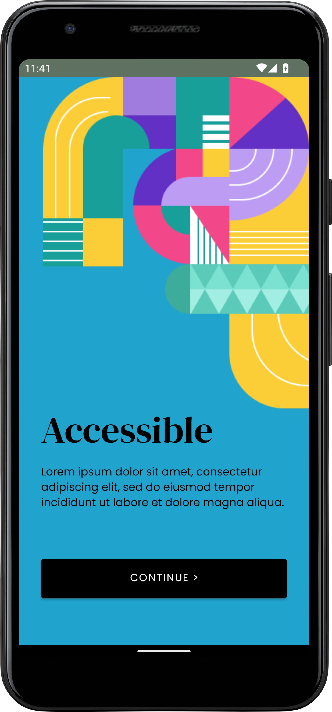

# SAIL — A community-driven wholesale platform.
SAIL is a community-driven wholesale platform that allows users to buy any product at cheaper rate than market by collaboratively placing orders.

Once a product has enough orders placed, our team buys the product in bulk from manufacturers at discounted rates and ships them directly to consumers. We eliminate the middle-man and only bring those products to the platform which are requested by our community.

## Screenshots

### Onboarding Experience


### Authentication with Google


### Cart


### Orders


## Product


## Technologies Used
  

## How to run this project?
To run this project on your local machine, you need to consider the following things.

- Create a Firebase account and add a project in the console.
- Generate credentials for an Android App in the project.
- Replace the defunct credentials in ```sail-app/app/google-services.json```
- Link SHA1 in Firebase to your app to avoid authentication issues.
- Lastly, open the app in Android Studio and let it setup everything.

## Acknowledgements
[Farhan Ali](https://github.com/hifarhanali) single-handedly implemented end-to-end Firebase connectivity and business logic for the app. Furthermore, he implemented the tabbed activities in the app through the use of fragments.